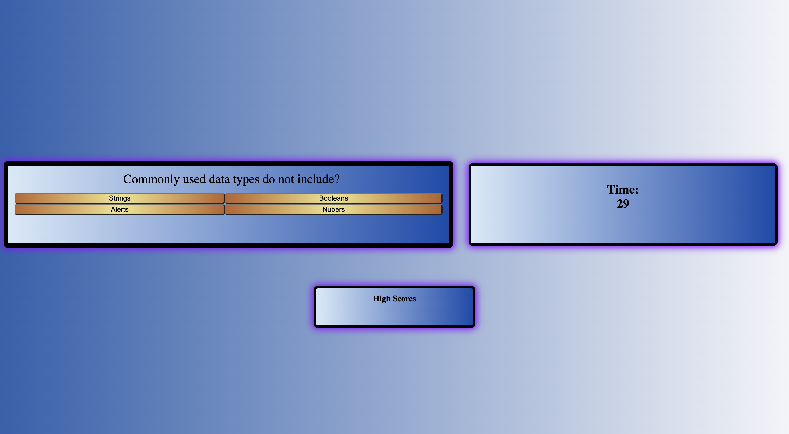

<h1>Javascript Quiz</h1>

## Table of Contents

  * [Description](#description)
  
  * [Links](#links)

  * [Questions](#questions)

## Description

- Create a quiz testing students knowlege of Javascript?
- I built this project to improve upon my understanding of Javascript and learn dynamic components of the program
- How to incorporate a timer and have dynamic pages without opening up a new browser

## Links
Git Pages: https://caliza.github.io/javascriptQuiz/

Git Hub: https://github.com/Caliza/javascriptQuiz

## Questions

- For any additional questions on usage of application, please contact at rances.rodriguez@gmail.com.